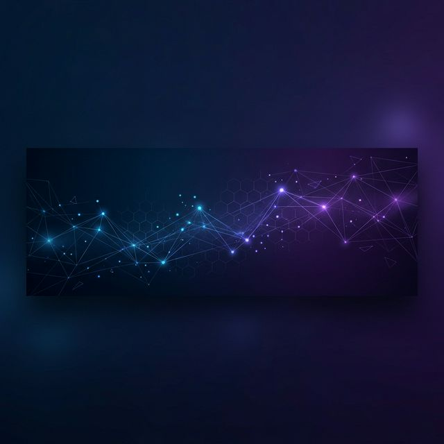

# 
Hi there 👋, I'm Veeramanikandan R

  

## 🚀 About Me

I am a **Full Stack Developer** and **Data Analysis Enthusiast** passionate about building scalable web applications and extracting meaningful insights from data. I specialize in the modern web ecosystem and data-driven architectures.

- 🔭 I’m currently working on advanced web applications and data modeling projects.
- 🌱 I’m currently learning **Advanced Machine Learning** and **Cloud Architecture**.
- 👯 I’m looking to collaborate on Open Source projects and Research initiatives.
- 💬 Ask me about **React, Node.js, Python, or Data Analysis**.
- 📫 How to reach me: [LinkedIn](https://www.linkedin.com/in/veeramanikandanr) | [Twitter](https://twitter.com/veera_r_tech)

## 🛠 Tech Stack

### 🌐 Frontend & Design

  
  
  
  
  

### ⚙️ Backend & Database

  
  
  
  
  
  

### 📊 Data Analysis & ML

  
  
  
  

## 📈 GitHub Stats

  

  

## 🌐 Connect with Me

    
    
    
    

    

